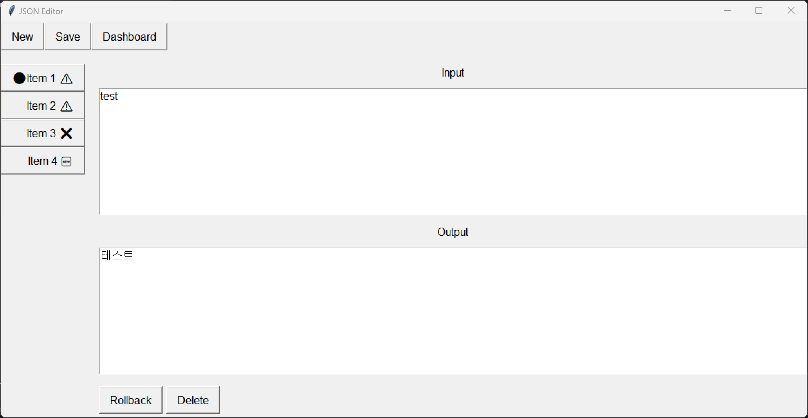

# JSON Data Editor

A simple GUI-based JSON data processing and editing tool built with Python's Tkinter library.

## Overview

The JSON Data Editor is a lightweight application designed to facilitate the creation, editing, and management of JSON data. It provides very simple interface for manipulating JSON files without the need to manually edit raw JSON code.

## Features

- **No External Dependencies** - It's implemented with only python builtin libraries. You can run this application by simply executing main.py  

## Future works
**This is currently in development project.**

More features to come
- Support for More Complex and Dynamic Data Structures
  - Plan to extend the application to handle more intricate JSON structures and dynamic data types.

- UI Improvements
  - Enhance the user interface for better usability and visual appeal.

- Dashboard for Simple EDA
  - Implement a dashboard that enables basic Exploratory Data Analysis (EDA) on the JSON data.
---

## Usage

1. **Run the Application**

   ```bash
   python main.py
   ```

## Requirements

- Python 3.x

# Screenshots



## License

This project is licensed under the MIT License. See the [LICENSE](LICENSE) file for details.
